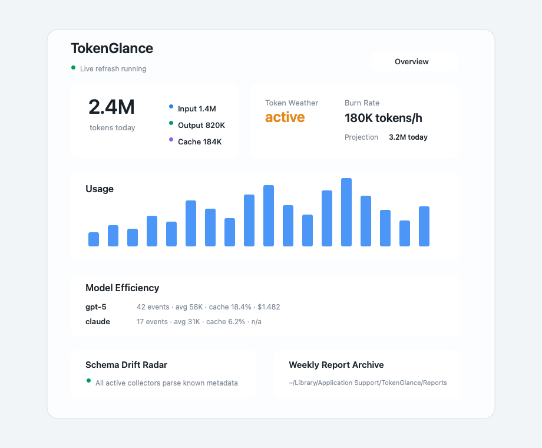
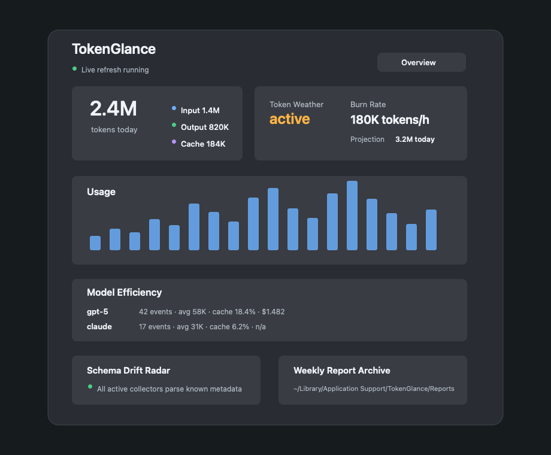

# TokenGlance

Private AI usage monitoring for the macOS menu bar.

TokenGlance is a native, local-first macOS app for understanding how intensely
your AI coding tools are working. It imports verified local token metadata,
keeps everything on your machine, and turns raw usage into a compact activity
monitor: menu-bar totals, sparkline, burn rate, Token Weather, model efficiency,
weekly reports, and collector health.

TokenGlance does not read prompts, responses, source code, shell history,
browser data, credentials, cookies, or private provider APIs.

| Light | Dark |
| ----- | ---- |
|  |  |

## Highlights

- Native macOS menu-bar monitor with live refresh and automatic relaunch after
  app updates.
- Tiny menu-bar sparkline plus tooltip details for peak hour, top model, cache
  share, burn rate, and projected daily usage.
- Token Weather for current usage intensity: calm, active, or stormy.
- Dashboard for today, last 24 hours, last 7 days, and last 30 days.
- Breakdown by input, output, cache, and reasoning tokens where available.
- Model Efficiency view with average tokens per event, cache share, reasoning
  share, and optional local cost estimates.
- Local cost profiles for private, user-defined model price estimates.
- Weekly Markdown report archive under local Application Support storage.
- Schema Drift Radar to flag local metadata that exists but no longer matches a
  supported parser shape.
- Collector diagnostics for supported local tools.
- CSV and JSON export of normalized usage metadata.
- Local-only storage with no account, backend, analytics, or telemetry.

## Requirements

- macOS 14 Sonoma or newer
- Apple Silicon
- Supported local tool metadata; TokenGlance never estimates from prompt text

## Installation

Install from the public Homebrew tap:

```bash
brew install --cask marcel-breuer/tap/tokenglance
```

Or tap once, then install by cask name:

```bash
brew tap marcel-breuer/tap
brew install --cask tokenglance
```

After tapping, TokenGlance is discoverable through Homebrew search:

```bash
brew search tokenglance
```

Upgrade an existing Homebrew installation:

```bash
brew update
brew upgrade --cask tokenglance
```

If TokenGlance is running during an app-bundle update, the app detects the
installed bundle version change and relaunches itself automatically.

Some releases may be ad-hoc signed rather than Developer ID signed and notarized.
Homebrew 6 no longer accepts the old `--no-quarantine` install option. If macOS
blocks the first launch, approve TokenGlance in System Settings > Privacy &
Security or remove the quarantine attribute for this app only:

```bash
xattr -dr com.apple.quarantine /Applications/TokenGlance.app
```

Do not globally disable Gatekeeper. Verify the published SHA-256 checksum before
installing.

## Supported Tools

| Tool | Detection | Historical import | Live updates | Token categories | Accuracy | Setup required |
| ---- | --------- | ----------------- | ------------ | ---------------- | -------- | -------------- |
| Codex CLI | Yes | Yes, from verified local JSONL token metadata | Reconciliation | input, output, cached input, reasoning, total when present | Exact | No |
| Claude Code | Yes | No by default | Telemetry parser available | input, output, cache read, cache creation | Exact when telemetry is configured | Yes |
| Antigravity | Yes, via `agy --version` | Not yet | Not yet | Not yet verified | Unavailable until a documented local token metadata source is verified | Yes |

Codex usage is imported from local token-count metadata in:

```text
~/.codex/sessions/
~/.codex/archived_sessions/
```

Antigravity is detected safely, but TokenGlance does not read Antigravity
conversations, logs, browser-style storage, or credentials until a documented
local token metadata source is verified.

## Privacy

All processing is local. TokenGlance does not upload usage data and does not
read credentials, browser data, shell history, clipboard contents, prompts,
responses, source code, cookies, or private provider APIs. Raw content
encountered near metadata is discarded and never persisted.

Data is stored under:

```text
~/Library/Application Support/TokenGlance/
```

Deleting local usage data removes TokenGlance's database records and collector
cursors; it never modifies source files belonging to external tools.

Weekly reports and settings, including local cost profiles, are stored only in
TokenGlance's Application Support directory.

## Local Analytics

TokenGlance is built around metadata-only insight:

- **Burn Rate**: current last-hour token velocity.
- **Token Weather**: a compact state for local AI activity intensity.
- **Model Efficiency**: model-level token totals, average event size, cache
  share, reasoning share, and optional cost estimates.
- **Cost Profiles**: local user-defined model pricing; no billing API or cloud
  account required.
- **Weekly Reports**: Markdown reports with trends, peak hour, top models, cache
  share, and token mix, archived locally.
- **Schema Drift Radar**: diagnostics for local metadata records that are present
  but no longer match a supported parser.

## Manual Installation

1. Download `TokenGlance-<version>-arm64.zip` from the official GitHub release.
2. Verify the published SHA-256 checksum.
3. Extract `TokenGlance.app`.
4. Move it to `/Applications`.
5. Open it and approve the launch in macOS Privacy & Security if Gatekeeper
   blocks the first launch.

## Development

```bash
swift build
swift test
./scripts/package-release.sh 0.1.1
```

Regenerate README screenshots:

```bash
swift scripts/render-readme-screenshots.swift
```

Docker is preferred when available, but this repository is a native macOS app and
requires the local macOS SDK/Xcode toolchain for build, test, and packaging.

## Release

The release script builds an optimized ARM64 app, signs it, verifies the app
bundle, creates a ZIP, and writes a SHA-256 checksum:

```bash
./scripts/package-release.sh 0.1.1
```

Artifacts:

- `dist/TokenGlance.app`
- `dist/TokenGlance-0.1.1-arm64.zip`
- `dist/TokenGlance-0.1.1-arm64.zip.sha256`

The GitHub release workflow updates the Homebrew cask after creating the release.
Configure `HOMEBREW_TAP_TOKEN` as a repository secret with write access to the tap
repository. The workflow defaults to `marcel-breuer/homebrew-tap`; set the
repository variable `HOMEBREW_TAP_REPOSITORY` to override it.

Developer ID signing and notarization are optional for local development but
required before submitting TokenGlance to the official Homebrew Cask tap. To
produce a Gatekeeper-accepted release in CI, configure these repository secrets:

- `DEVELOPER_ID_CERTIFICATE_BASE64`: base64-encoded `.p12` Developer ID
  Application certificate.
- `DEVELOPER_ID_CERTIFICATE_PASSWORD`: password for the `.p12` certificate.
- `DEVELOPER_ID_APPLICATION`: exact codesign identity, for example
  `Developer ID Application: Example Name (TEAMID)`.
- `KEYCHAIN_PASSWORD`: temporary CI keychain password.
- `APPLE_ID`: Apple ID used for notarization.
- `APPLE_TEAM_ID`: Apple Developer Team ID.
- `APPLE_APP_SPECIFIC_PASSWORD`: app-specific password for notarization.

With those secrets present, `./scripts/package-release.sh` signs with the
Developer ID identity, submits the ZIP to Apple notarization, staples the app,
verifies it with Gatekeeper, and regenerates the final ZIP/checksum.

## Official Homebrew Listing

TokenGlance is not listed on brew.sh/formulae.brew.sh yet because those pages
index the official Homebrew taps. To appear there, TokenGlance must be accepted
into `Homebrew/homebrew-cask`.

Before submitting, the app should launch with Gatekeeper enabled on supported
macOS versions, meet Homebrew's notability expectations for new, self-submitted
casks, and pass Homebrew Cask audit. Until then, the public tap remains the
supported distribution channel for external users.

## Roadmap

- User-approved Claude Code telemetry setup helper.
- User-approved Antigravity token metadata setup when a documented local source
  is verified.
- More local report export formats.
- Optional budget thresholds and local notifications.
- Additional collectors only after documented local metadata sources are
  verified.

## License

MIT
